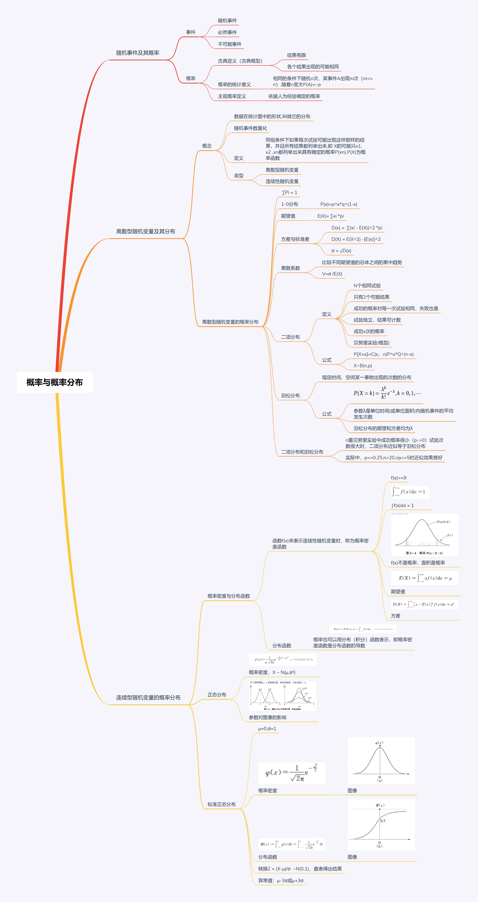

# statis_learning
统计学的学习
图片较大可能显示有问题

## 数据的图表展示
[data_display](./data_display/statis_data_display.ipynb)  

## 数据的概括性度量
[data_general_measure](./data_general_measure/stats_data_general_measure.ipynb)  

## 概率与概率分布
[probability_theory](./probability_theory/probability_theory.ipynb)  

## 统计量与抽样分布
[stats_sample_distribution](./stats_sample_distribution/stats_sample_distribution.ipynb)

## 参数估计
[parameter_estimation](./parameter_estimation/parameter_estimation.ipynb) 